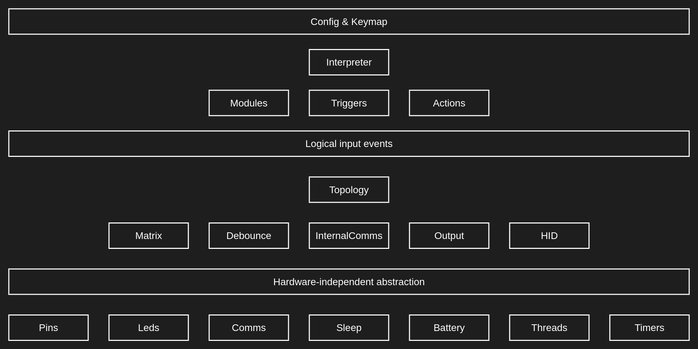

# Firmware structure proposal

As a further refinement of the low/mid/high layers (and following the advice algernon mentioned in the chat), we could even formalize sub-interfaces (he called them "drivers") which could then be mixed and matched using a simple config.

## Low level

Our first job is to abstract away any hardware-specific dependency.
Areas to address here include:

- how pins (both digital and analogue) are accessed
- how raw leds can be controlled
- how low level communication can happen, including
    - wired (I2C)
    - raw custom-protocol inter-chip radio
    - BLE
- how to go to sleep to save energy
- how to read the battery charge
- how to handle multiple threads and timers for parallelism and efficiency

The union of these can provide a uniform interface other layers can build upon.

## Mid level

So far, by "hardware independence" we meant the controller chip running the show.
This layer goes a step beyond this by abstracting away other hardware-related issues, like:

- how the actual input generators are wired (various matrix scanning and debouncing strategies)
- how many parts there are to the keyboard, and how these want to communicate among each other (internal communication protocols and standard HID so that eventually the end device can also understand)
- how output (or feedback) devices like led matrices, displays, tone generators, etc. should be controlled

Finally, a topology can bundle these together to handle input event collection and output command distribution among the parts.

## High level

At this point, we can deal with simple, logical input events, form a queue of them, and process them on order.

- Modules would add high-level concepts like layers, oneshots, or macros (in addition to everything the midware already provides)
- Triggers would specify when a certain input event queue matches to be able to distinguish between pressing and releasing a key, tap/hold duos, or any complex "tapdance" configurations
- Actions would represent the responses to a trigger matching, like generating some output (sending a HID report or changing a led green) or changing some internal state (the layer is now raise, but only for the following event)

The Interpreter at the top is responsible for reading a high level keymap, loading modules and building its own trigger/action pairs accordingly, and keeping the queue in order.