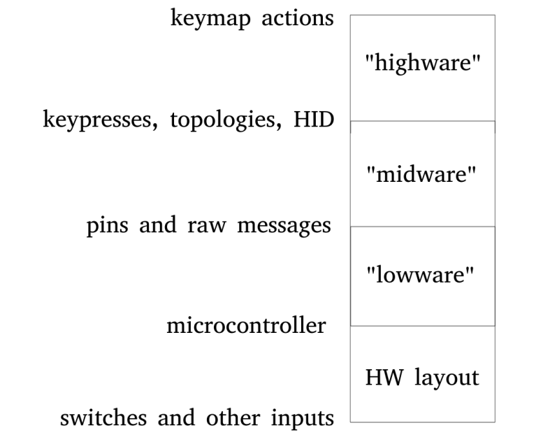

The most important goal of this organization is to define a set of standard proposals for Bluetooth-first keyboard firmwares.
To keep everyone from having to reinvent the wheel each time, we propose a fairly strict modularization.

The "0th" layer is how we get from the inputs to the controller, and this is where most of the hardware concerns lie.
Arguably the most important issue here would be a uniform board footprint, so that we can reliably expect how the various PCBs need to interact with the Bluetooth-ready controller.
The current "de facto" standard seems to be the "Pro Micro with two extra holes at the top for the battery", which appears an optimal choice for compatibility, but further discussion might be needed.

Once we get to the MCU, we additionally propose a formal separation of concerns with this low-mid-high metaphor.
Low would deal with the hardware-specific tooling, libs, SDKs, and use whatever it has to to get to a common interface.
This level would provide things like generalized pin access, timers, and some low level communication abstraction (either wired or wireless).
This would make it possible to change controller chips by changing the "lowware" accordingly, and everything else could remain the same.

On top of this comes the middle layer, which uses the raw communication capabilities of the "lowware" to establish links with other parts (like halves of a split keyboard, or keyboard vs. PC, or a separate third numpad, etc.) and provide a HID interface.
It would also map the raw pin signals to physical input events (either keypresses by matrix scanning, or direct wiring, if we happen to have enough GPIOs, or encoder value changes, etc.).

And finally comes the top layer, which performs all the completely hardware-agnostic, high-level keyboard firmware functionalities like managing keymaps and handling layers, oneshots or tap-mods...
Doing whatever it has to to map individual input events to their corresponding HID results or internal state changes.

This way, adopters would need to write one "lowware" for every controller kind, one "midware" for every kind of topology participant (slave, master, relay?), and just one single "highware" which would be completely reusable.
Of course, one could write multiple lowwares for a single controller, too, to test different lib implementations.

A final explicit standard would define how keyboard manufacturers can specify their per-keyboard configs, and how end users can specify their personal keymaps.
Using these, a build system would automatically select the appropriate low- and midware implementations, configure the highware, and enclose everything in the hardware-appropriate event loop before compiling a binary.